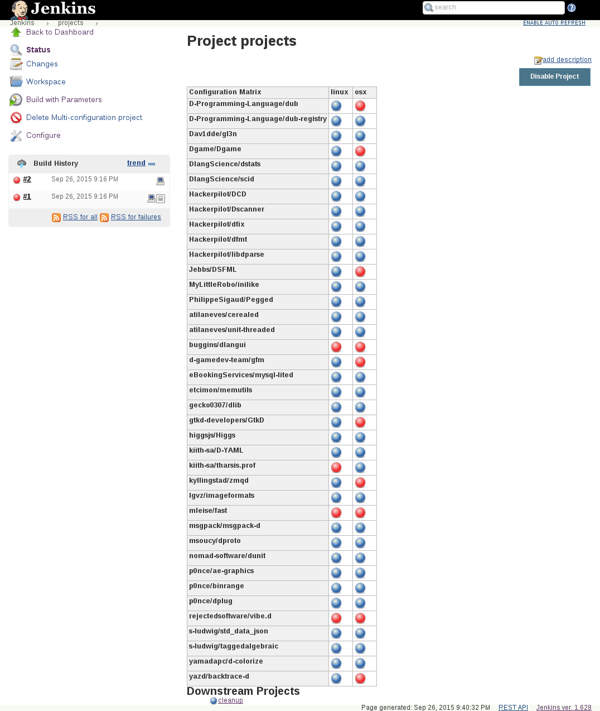

# D Project Tester

This repo contains Jenkins job configurations to test several D projects.
The projects were chosen by [DUB](http://code.dlang.org/) download numbers.

Currently there are 3 jobs that are executed consecutively.

- [DPL](DPL.xml)
  Builds dmd, druntime, and phobos. Each parameterizable by either a branch (default is stable) or PR number.

- [projects](projects.xml)
  Builds and tests a list of 30+ projects using dmd/phobos from above.

- [cleanup](cleanup.xml)
  Cleans out all .dub caches and libraries.

You need to have a recent version of dmd and dub installed. Some
projects also need additional development libraries, e.g. libenet-dev,
[zeromq](http://zeromq.org/), and [DSFML-C](https://github.com/Jebbs/DSFML-C).

There are [backup](/backup.sh) and [restore](/restore.sh) scripts to dump/restore jenkins configurations.
